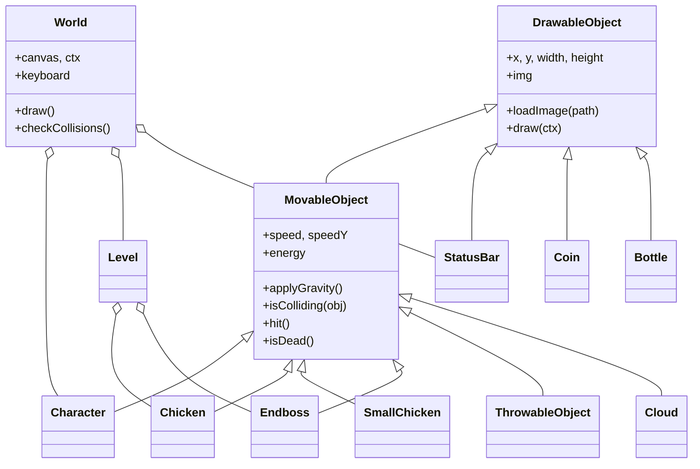

<!--
  ================================================================
  README-TEMPLATE
  Alle Stellen in {{GROSSBUCHSTABEN}} ersetzen. Abschnitte, die für
  ein Projekt nicht passen, komplett löschen.
  Suchen nach "{{" zeigt alle offenen Platzhalter.
  ================================================================
-->

<div align="center">


# El Pollo Loco

**Jump-and-Run-Browsergame in objektorientiertem Vanilla-JavaScript und HTML5 Canvas**

[]({{LIVE_URL}})
[](#technologien)
[](#technologien)
[](#technologien)

[Live Demo]({{LIVE_URL}}) · [Features](#features) · [Steuerung](#steuerung) · [Architektur](#architektur) · [Installation](#installation)

</div>

---

## Inhaltsverzeichnis

1. [Über das Projekt](#über-das-projekt)
2. [Screenshots](#screenshots)
3. [Features](#features)
4. [Steuerung](#steuerung)
5. [Technologien](#technologien)
6. [Architektur](#architektur)
7. [Projektstruktur](#projektstruktur)
8. [Installation](#installation)
9. [Coding Standards](#coding-standards)
10. [Was ich gelernt habe](#was-ich-gelernt-habe)
11. [Roadmap](#roadmap)
12. [Credits](#credits)
13. [Autor](#autor)

---

## Über das Projekt

**El Pollo Loco** ist ein 2D-Side-Scroller, entstanden als Einzelprojekt im Rahmen der Weiterbildung zum Frontend-Entwickler an der **Developer Akademie**.

Der Spieler steuert **Pepe** durch die mexikanische Wüste, sammelt Münzen und Salsa-Flaschen und kämpft sich an Hühnern vorbei bis zur verrückten Riesenhenne – dem Endboss.

Schwerpunkt des Projekts ist **objektorientierte Programmierung (OOP)** mit JavaScript-Klassen und Vererbung, eine eigene Game-Loop auf dem HTML5 Canvas sowie Kollisionserkennung – ohne Framework oder Game-Engine.

---

## Screenshots

| Startscreen | Gameplay | Endboss |
|:---:|:---:|:---:|
|  |  |  |

> Tipp: Ein kurzes GIF (5–10 Sekunden Gameplay) wirkt stärker als drei Standbilder.

---

## Features

**Gameplay**
- Spielfigur mit Animationszuständen: Idle, Long-Idle, Laufen, Springen, Verletzt, Tod
- Zwei Gegnertypen (Huhn, Küken) – besiegbar durch Draufspringen
- Werfbare Salsa-Flaschen mit Splash-Animation
- Endboss mit eigenen Zuständen (Alarm, Angriff, Verletzt, Tod) und Lebensbalken
- Sammelbare Münzen und Flaschen

**Interface**
- Statusleisten für Leben, Münzen, Flaschen und Endboss
- Start-, Gewinn- und Game-Over-Screen mit Neustart
- Parallax-Hintergrund mit Kamera-Verfolgung
- Hintergrundmusik und Soundeffekte mit Mute-Funktion (Zustand bleibt gespeichert)
- Vollbildmodus

**Responsive**
- Spielbar von Desktop bis 320 px Breite
- Touch-Buttons auf mobilen Geräten
- Hinweis zum Drehen des Geräts im Hochformat

---

## Steuerung

### Tastatur

| Aktion | Taste |
|---|---|
| Nach links laufen | <kbd>←</kbd> |
| Nach rechts laufen | <kbd>→</kbd> |
| Springen | <kbd>Space</kbd> |
| Flasche werfen | <kbd>{{WURF_TASTE}}</kbd> |
| {{WEITERE_AKTION}} | <kbd>{{TASTE}}</kbd> |

### Mobil

Auf Touch-Geräten erscheinen Buttons für Laufen, Springen und Werfen am unteren Bildschirmrand.

---

## Technologien

| Bereich | Einsatz |
|---|---|
| **JavaScript (ES6)** | Klassen, Vererbung, Game-Loop, Kollisionslogik |
| **HTML5 Canvas** | Rendering aller Spielobjekte |
| **CSS3** | Layout, Media Queries, Overlays |
| **JSDoc** | Dokumentation aller Funktionen und Methoden |

Keine externen Bibliotheken, kein Build-Tool.

---

## Architektur

Alle Spielobjekte erben von einer gemeinsamen Basisklasse. `World` hält den Zustand, zeichnet jedes Frame und prüft Kollisionen.



> Klassennamen an das eigene Projekt anpassen. GitHub rendert Mermaid-Diagramme automatisch.

---

## Projektstruktur

```
elPolloLoco/
├── index.html
├── impressum.html
├── style.css
├── img/                     # Sprites, Hintergründe, Icons
├── audio/                   # Musik und Soundeffekte
├── js/
│   ├── game.js              # Init, Tastatur-Events, UI
│   └── keyboard.js
├── models/
│   ├── drawableObject.js
│   ├── movableObject.js
│   ├── character.js
│   ├── chicken.js
│   ├── smallChicken.js
│   ├── endboss.js
│   ├── throwableObject.js
│   ├── statusBar.js
│   ├── level.js
│   └── world.js
└── levels/
    └── level1.js
```

---

## Installation

Das Spiel läuft ohne Installation direkt im Browser: **[{{LIVE_URL}}]({{LIVE_URL}})**

Lokal starten:

```bash
git clone {{REPO_URL}}
cd {{REPO_ORDNER}}
```

Anschließend `index.html` mit einem lokalen Server öffnen, z. B. der VS-Code-Erweiterung **Live Server**.

> Direktes Öffnen per Doppelklick (`file://`) kann je nach Browser beim Laden von Bildern und Audio Probleme verursachen.

---

## Coding Standards

Das Projekt folgt den Clean-Code-Vorgaben der Developer Akademie:

- Funktionen maximal 14 Zeilen, eine Aufgabe pro Funktion
- Dateien maximal 400 Zeilen
- camelCase für Funktionen, Variablen und Dateinamen
- Alle Funktionen nach JSDoc dokumentiert
- Kein Inline-JavaScript im HTML
- Keine Konsolenfehler oder `console.log()`-Ausgaben
- Responsive bis 320 px ohne horizontales Scrollen

---

## Was ich gelernt habe

- {{LERNPUNKT_1 – z. B. Vererbung und Klassenhierarchien sinnvoll schneiden}}
- {{LERNPUNKT_2 – z. B. Game-Loop mit setInterval und requestAnimationFrame}}
- {{LERNPUNKT_3 – z. B. Kollisionserkennung mit Offsets}}
- {{LERNPUNKT_4 – z. B. Intervalle sauber stoppen beim Neustart}}

---

## Roadmap

- [ ] {{GEPLANTES_FEATURE_1 – z. B. weiteres Level}}
- [ ] {{GEPLANTES_FEATURE_2 – z. B. Highscore}}
- [ ] {{GEPLANTES_FEATURE_3}}

---

## Credits

- Grafiken und Spielkonzept: **Developer Akademie**
- Sounds: {{QUELLE_DER_SOUNDS}}
- Schriftart: {{SCHRIFTART_UND_QUELLE}}

Dieses Projekt ist ein Lernprojekt und steht in keiner Verbindung zur gleichnamigen Restaurantkette.

---

## Autor

**{{DEIN_NAME}}**
Frontend-Entwickler

[]({{PORTFOLIO_URL}})
[]({{LINKEDIN_URL}})
[]({{GITHUB_PROFIL_URL}})

<div align="center">
<sub>Entstanden {{JAHR}} im Rahmen der Frontend-Weiterbildung der Developer Akademie.</sub>
</div>
